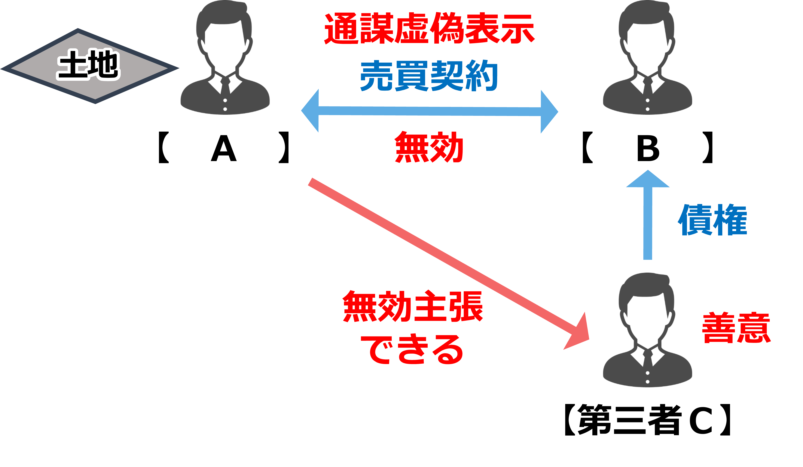
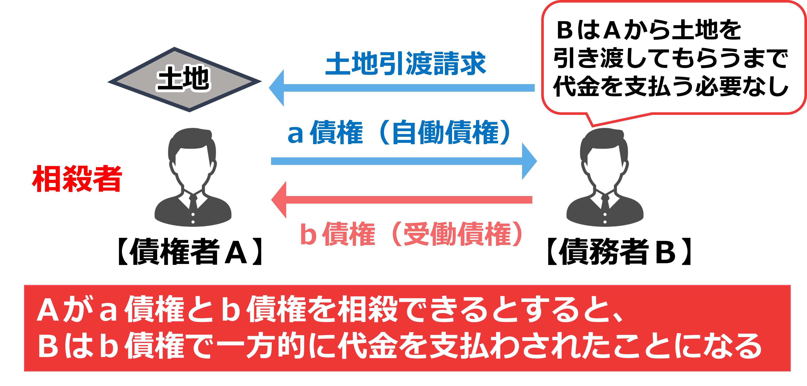
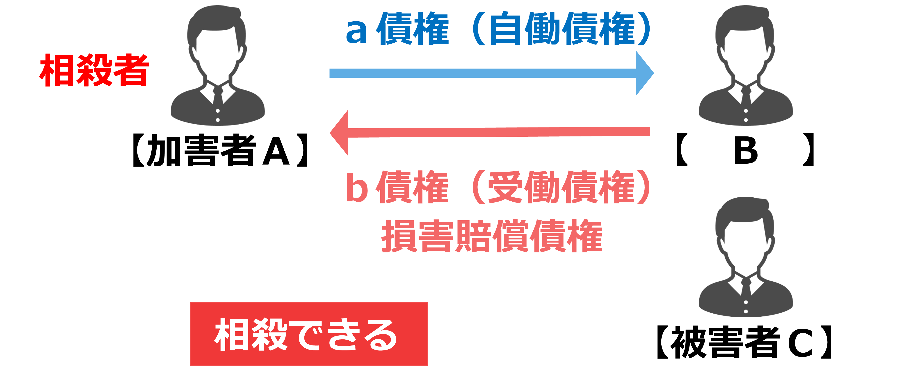

# 法律用語およびキーワード、
## 法律用語 
- 身分行為：婚姻や養子縁組など、法律上の身分関係に変化をもたらす法律行為
- 「別段の意思表示」は、**本人及び相手方双方の合意という意味**
- 寄託とは、当事者の一方が目的物の保管を委託し、相手方がこれを承諾することによって成立する契約です  
	保管を引き受ける者を「受寄者」、保管を委託する者を「寄託者」といいます。
 - 胎児については，下記の3項目の場合、「すでに生まれたものとみなす」
 	- **不法行為に基づく損害賠償請求（民721条）**
	-	**相続（民886条1項）**
	- **遺贈（民965条）**  
## 無効・取消について
- 無効：最初から法律行為の効果が発生しないことをいう。  
	民法規定無効（５形態）
	- 意思無能力者のした法律行為（民法第3条の2）
	- 公序良俗に反する法律行為（民法第90条）
	- 強行規定に反する法律行為（民法第91条）
	- 心裡留保による意思表示があった場合で、相手方が悪意又は有過失の場合（民法第93条第1項但書）
	- 通謀虚偽表示による法律行為（民法第94条第1項）
- 取消し：取消しの意思表示によって最初から法律行為の効果が発生しないことをいう

無効は、永久に主張することができます。  
いっぽう、取消権は、追認をすることができる時から5年間行使しないとき、又は、行為の時から20年を経過したときは、時効によって消滅します（民126条）。
## 追認・法定追認
追認とは、取り消すことのできる行為を確定的に有効なものとする意思表示のことをいい、追認することができる者は、取消権者と同じである
### 法定追認
民法第125条に掲げられた行為があれば、追認したとみなされる。  
<b>債権者=取消権者</b>と考えれば、わかりやすい。

法定追認に該当する行為を行う際に、**異議をとどめておけば**、追認をしたものとはみなされません（民125条但書）。

<table>
<tbody>
	<tr>
		<td></td>
		<td>債権者</td>
		<td>債務者</td>
	</tr>
	<tr>
		<td>全部又は一部の履行</td>
		<td>○</td>
		<td>○</td>
	</tr>
	<tr>
		<td>履行の請求</td>
		<td>○</td>
		<td>×</td>
	</tr>
	<tr>
		<td>更改</td>
		<td>○</td>
		<td>○</td>
	</tr>
	<tr>
		<td>担保の供与</td>
		<td>○</td>
		<td>○</td>
	</tr>
	<tr>
		<td>取り消すことができる行為によって取得した権利の全部又は一部の譲渡</td>
		<td>○</td>
		<td>×</td>
	</tr>
	<tr>
		<td>強制執行</td>
		<td>○</td>
		<td>×</td>
	</tr>
</tbody>
</table>

以上　
## 不当利得返還請求
要件（４つ）
1. 利得
1. 損失
1. 利得と損失の間の因果関係
1. 法律上の原因がないこと，の４つです。
# 意思決定無能力者
- 10歳未満の子供
- 精神障害等で、意思決定を行うことができないもの
- 泥酔者
意思決定無能力者が行った行為は、**無効**
# 制限行為能力者
制限行為能力者の行為は、**取消**ができる。

|制限|同意権|代理権|
|--|:--:|:--:|
|成年後見|✖|〇|
|保佐人|〇|△|
|補助人|△|△|

成年後見人には、同意権は**ありません**、過去問等で、成年後見人の同意を得ずにとありますが、全く意味がありません。（取消可能）

△ 審判開始の際に、その権利を付与できる  
保佐人の代理権は、審判の際に付与するかどうかを決める。

補助人は、審判で、同意権及び代理権を付与するかどうかを決める、基本は代理権は設定しない。  
また、同意権に関しても本人の同意が、必要である。
# 不在者の財産管理・失踪
裁判所による失踪宣告は、7年経過した後に死亡したとみなされる
- <u>特別失踪の「危機が去った時」</u>  
  戦争や自然災害、船舶の沈没などの危難が去った時点を指します。  
  危機が去った時に、**死亡**したとみなされます
  特別失踪は、この危難が去った後に1年間生死不明が続いた場合に、家庭裁判所に失踪宣告を申し立てることで認められる制度

失踪宣告によって財産を得た者は、失踪宣告の取消しがあった場合には、<u>**現に利益を受けている限度（現存利益）**</u>においてのみ返還義務を負います（民32条2項）

金銭費消での現存利益
- 遊興費で使った場合は、現存利益なし
- 生活費で使った場合は、現存利益あり

夫婦の一方は、配偶者の生死が３年以上明らかでないときは、離婚の訴えを提起することができます（民770条1項3号）。
# 権利なき財団
- <u>総有</u>  
  権利能力なき社団の総有とは、構成員が使用収益権は有しているものの、持分権は有しない>共同所有の一形態です
# 意思表示
## 民法94条第2項の第三者
- **単なる一般債権者**は、94条2項の<u>「第三者」には該当しません</u>。  
したがって、ＡがＣに対してＡ・Ｂ間の売買契約の無効を主張した場合、当該主張は認められます。
- **仮装債権の譲受人**は、民法94 条2項の<u>第三者として保護されます</u>
- 債権者が仮装目的物を
-  **差し押さえた場合**は、94条2項の<u>「第三者」に該当します</u>
- 土地の仮装譲受人から地上建物を賃借した者は、民法94条2項の<u>第三者として保護されません</u>
虚偽での第三者が保護されるためには第三者が善意であること（事情を知らないこと）を要件としており、第三者が**無過失であることまでは要求していない**
虚偽以外は、**善意無過失** を要求しています

### 虚偽表示により土地を取得した者が、その土地上に建物を建築した場合に、その建物を賃借した者（最判昭57.6.8）
虚偽表示により土地を取得した者が、その土地上に建物を建築した場合に、その建物を賃借した者は、民法第94条第２項の第三者には該当しません。

例えば、ＡＢ間でＡ所有の甲土地について通謀虚偽表示に基づいて売買契約がなされたとします。その後、Ｂが甲土地の上に乙建物を建てて、乙建物をＣに賃貸したとします。この場合、Ｃは建物を賃借したのであり、土地を賃借したわけではありませんので、虚偽表示が有効であることを信じて、新たに独立した法律上の利害関係を持つに至った者とはいえず、ＡＢ間の甲土地の売買契約については、民法第94条第２項の第三者には該当しません。

## 詐欺の成立要件
詐欺が成立するためには、詐欺の二重の故意が必要です。
- 「<b>錯誤</b>に陥れる故意」  
  錯誤に陥っていない場合は、詐欺者がだまそうとしていることを承知で意思表示をしたことになり、詐欺を理由に意思表示を取り消すことはできません
- 「それに基づいて意思表示をさせる故意」

### 判例（事例）
- Ａは、その所有する甲土地のＢへの売却がＢの詐欺によることに気付いた後（取消をしていない）、甲土地の売買代金債権をＣに譲渡しています。  
  この行為は**法定追認**に当たりますので、Ａは、Ｂの詐欺を理由に、Ｂとの間の甲土地の売買契約を取り消すことができません
## 錯誤
錯誤の相手方は、取消権者でに当たらない
## 虚偽
# 代理
意思決定無能力者は、代理人になれないが、制限行為能力者は、代理人になれ、その効果は、本人に帰属します。 

代理人が本人のためにすることを示さないでした意思表示は、自己のためにしたものとみなされます（民100条本文）。  
この点、代理人が本人のためにすることを示さずに意思表示をした場合であっても、相手方が、代理人が本人のためにすることを知り、又は知ることができたときは、その権限内において本人のためにした行為は、本人に対して直接にその効力を生じます

復代理人の代理権は、復代理人を選任した<b>原代理人の権限に基づき</b>ますので、復代理人の代理権は原代理人の権限の範囲内となるのです。

無権代理行為の追認は、別段の意思表示がないときは、契約の時にさかのぼってその効力を生じます（民116条本文）。ただし、第三者の権利を害することはできません（民116条但書）  
無権代理人の行為と第三者の行為が競合する場合の優劣は、<b>対抗要件の具備の有無</b>によって決せられます。
## 代理人消滅事由
人側の事由か、代理人側の事由かでも消滅事由は異なります。
<table>
<tbody>
	<tr>
		<td colspan="2"></td>
		<td>死亡</td>
		<td>後見開始の審判</td>
		<td>破産手続開始決定</td>
		<td>相互解除</td>
	</tr>
	<tr>
		<td rowspan="2">法定代理人</td>
		<td>本人</td>
		<td>○</td>
		<td>×</td>
		<td>×</td>
		<td>×</td>
	</tr>
	<tr>
		<td>代理人</td>
		<td>○</td>
		<td>○</td>
		<td>○</td>
		<td>×</td>
	</tr>
	<tr>
		<td rowspan="2">任意代理人</td>
		<td>本人</td>
		<td>○</td>
		<td>×</td>
		<td>○</td>
		<td>○</td>
	</tr>
	<tr>
		<td>代理人</td>
		<td>○</td>
		<td>○</td>
		<td>○</td>
		<td>○</td>
	</tr>
</tbody>
</table>

（○：消滅　　×：消滅しない）
## 復代理
代理人は，**本人の許諾を得ることなく**，復代理人を解任することができます。これは，復代理人が本人の許諾を得て選任された者である場合であっても，同様です。
復代理人でも、行為能力者である必要はない、代理人と同じ規定になります。
## 法定代理人
- 親
- 成年後見人
- 遺言執行者
## 表見代理
### 成立要件
- 第3者に対して他人に代理権を与えたと表示した場合  
- 相手方が**善意無過失**
### 表見代理の種類 
- 代理権授与の表示による表見代理（民法第109条第１項）
- 前提として基本代理権が存在すること、権限外の行為の表見代理（民法第110条）
- 代理権消滅後の表見代理（民法第112条第１項）
# 時効
- 不動産の所有権を時効取得した場合、設定されていた担保権は消滅する
- 地役権は、継続的に行使され、かつ、外形上認識することができるものに限って、時効により取得することができる。  
	地役権は、継続的に行使され、かつ、外形上認識することができるものに限り、時効によって取得することができます（民283条）。
	この点、通行地役権においては、要役地所有者による通路の開設が必要とされているため（最判昭30.12.26）、他人の土地の通路を開設することのないまま通行した隣地の所有者は、その他人の土地について、通行地役権を時効により取得することができません。
- 賃借権の時効取得は、認められる  
	土地の継続的な用益という外形的事実が存在し、かつ、それが賃借の意思に基づくものであることが客観的に表現されているときは、土地賃借権を時効により取得することができるとされています（最判昭43.10.8、最判昭62.6.5）
## 消滅時効
- 所有権は消滅時効にかからない。
- 債権は、権利を行使することができることを知った時から5年間、権利を行使することができる時から10年間で時効によって消滅する。
- 債権・所有権<b>以外の財産権</b>は、権利を行使することができる時から20年間で時効によって消滅する。

売主の担保責任に係る損害賠償請求権の消滅時効は、買主が目的物の引渡しを受けた時から進行するとされています（最判平13.11.27）。
## 時効の更新・完成猶予
時効の更新の効果を生じる債務の承認をなすには、管理行為の能力・権限は必要ですが、処分する行為能力・権限は不要です（民152条2項）。  
被保佐人は、処分する行為能力・権限はないものの、管理能力・権限は有していますので、単独で（＝保佐人の同意なしに）債務の承認をすることができます。  
<u>※未成年者や成年被後見人は単独で有効に債務の承認をすることができません。</u>

夫婦の一方が他の一方に対して有する権利については、婚姻解消の時から6か月を経過するまでの間、時効は完成しません（民159条）

所有権は消滅時効にかからないところ、これから派生する所有権に基づく妨害排除請求権も同様に消滅時効にかからないとされています（大判大11.8.21）。  
いっぽう、占有保持の訴えは、妨害の存する間又はその消滅した後1年以内に提起しなければなりません  
(※占有者がその占有を妨害された場合に、その妨害の停止や損害賠償を請求できる訴え 民198条)

債権者は、債務者が、他の債権者に対して負担する債務、又は他人の債務のために物上保証人となっている場合におけるその被担保債権について、その消滅時効を援用することができる地位にあるのにこれを援用しないときは、債務者の資力が自己の債権の弁済を受けるについて十分でない事情にある限り、その債権を保全するに必要な限度で、債務者に代位して他の債権者に対する債務の消滅時効を援用することができるとされています（最判昭43.9.26）。

相続財産に関しては、相続人が確定した時、管理人が選任された時又は破産手続開始の決定があった時から６ヵ月を経過するまでの間は、時効は完成しません（民160条）

不法行為に基づく損害賠償請求権は、被害者又はその法定代理人が損害及び加害者を知った時から3年間行使しないときに時効消滅するのが原則ですが、人の生命又は身体を害する不法行為の場合には5年に延ばされています。  
（※ 不法行為の時から20年です）
# 債権
## 特定債権
特定物の引渡しについては、債務者は、その引渡しをするまで善良な管理者の注意をもって、目的物を保管する義務を負います（民400条）。  
もっとも、債権者の受領遅滞がある場合には債務者の注意義務が軽減され、履行の提供をした時からその引渡しをするまで、**自己の財産に対するのと同一の注意義務**をもって目的物を保存すれば足ります（民413条1項）。
したがって、Ａは、もはや善良な管理者の注意義務を負うことはありません。
## 債務不履行
### 履行遅滞

履行遅滞に陥る時期については、債務ごとに考える必要があります。  
消滅時効の起算点と比較して覚えておいて下さい。

<table>
<tbody>
<tr>
<td></td>
<td>消滅時効の起算点</td>
<td>履行遅滞に陥る時期</td>
</tr>
<tr>
<td>確定期限ある債権</td>
<td>期限到来の時</td>
<td>期限到来の時</td>
</tr>
<tr>
<td>不確定期限のある債権</td>
<td>期限到来の時</td>
<td><ul><li>期限が到来し、かつ、債務者がこれを知った時</li><li>期限到来後、債権者が催告した時</li></ul></td>
</tr>
<tr>
<td>期限の定めのない債権</td>
<td>債権成立の時</td>
<td>履行の請求を受けた時</td>
</tr>
<tr>
<td>債務不履行に基づく損害賠償請求権</td>
<td>本来の債務の履行を請求することができる時</td>
<td>履行の請求を受けた時</td>
</tr>
<tr>
<td>不法行為に基づく損害賠償請求権</td>
<td>被害者又はその法定代理人が損害および加害者を知った時</td>
<td>不法行為の時</td>
</tr>
<tr>
<td>停止条件付債権</td>
<td>条件成就の時</td>
<td>条件成就後請求を受けた時</td>
</tr>
</tbody>
</table>  

上記の表以外でので、判例等

- 善意の不当利得者の不当利得返還債務（民法第703条）は、期限の定めのない債務とされており、債務者が履行の請求を受けた時から遅滞となります。　  
- 賃貸借契約に基づく敷金返還債務は、賃貸借が終了し、かつ、賃貸物の返還を受けたときに発生します（民法第622条の２第１項第１号）。  
そして、敷金返還債務は不確定期限付債務とされており、履行遅滞に陥るのは、明渡し後に債務者である賃貸人が期限の到来を知った時となります。  
- 雇用契約上の安全配慮義務違反を理由とする債務不履行に基づく損害賠償債務は、期限の定めのない債務とされていますので（最判昭55.12.18）、債務者が債権者から履行の請求を受けた時から遅滞となります。  
- 返還時期の定めのない**金銭消費貸借契約**では、債権者は相当の期間を定めて返還の催告をすることができ、**相当期間経過後**に遅滞となります（民法第591条第１項参照）。  
また、債権者が相当の期間を定めないで催告した場合であっても、相当の期間を経過することで遅滞に陥るとされています（大判昭5.1.29）。  
- 履行不能  
履行不能とは、債務の履行が契約その他の債務の発生原因及び取引上の社会通念に照らして不能であることです（民法第412条の２第１項）。履行不能とされるのは、給付が物理的に不可能な場合に限られません。物理的に可能であっても、給付をすることが法律により禁止されている場合や契約その他の債務の発生原因に照らして履行をすることが期待できない場合も履行不能とされます。
- 不完全履行  
不完全履行とは、履行はなされたものの、債務者の責めに帰すべき事由によって、債務の本旨に従った履行がなされなかったことです。
　例えば、購入したパソコンに欠陥がある場合、家具を家に搬入する際に、壁に傷をつけてしまった場合です。  

不完全履行の場合、追完可能であれば履行遅滞に準じ、追完不可能であれば履行不能に準じて処理をします。

利息の支払が遅延した場合、1年以上延滞され、債権者が催告しても支払われないときには、債権者は、利息を元本に組み入れることができますが（民405条）、利息について、当然に遅延損害金が生じるわけではありません

人の生命又は身体の侵害による損害賠償の債務については、相殺をもって債権者に対抗することができません（民509条2号）。そのため、Ａは、債務不履行に基づく損害賠償請求に対しても、不法行為に基づく損害賠償請求に対しても、診療諸費用の債権をもって相殺をすることはできません
# 責任財産の保全 & 詐害（債権者）取消権
## 債権者代位権の要件
債権者代位訴訟の被告は第三債務者です

1. 被保全債権が強制執行により実現することのできるものであること  
	被保全債権は金銭債権のみならず、登記請求権のように金銭債権ではない場合でもよいとされています（民法第423条の７）。
1. 被保全債権が履行期にあること  
	例外として「保存行為」の場合は、被保全債権の履行期が到来していなくても債権者代位権を行使できます
1. 債務者が無資力であること  
	被保全債権が金銭債権以外の場合は、資力があっても債権を保全する必要があることから、債務者の無資力は要求されません。
1. 債務者がいまだ被代位権利を行使していないこと  
	債務者の権利行使が不十分、不適切な場合には、債権者は債務者の提起した訴訟に補助参加（民訴法第42条）し、あるいは独立当事者参加（民訴法第47条）しうると解されています。  
1. 権利を行使するか否かが権利者（債務者）の個人的意思にゆだねられるべき権利や差押えを禁じられた権利については、代位行使になじまないので、「被代位権利が一身専属権、または差押禁止債権でないこと」が要件とされています。

<table>
<tbody>
	<tr>
		<td rowspan="2">一身専属権</td>
		<td colspan="2">権利を行使するか否かが権利者（債務者）の個人的意思にゆだねられるべき権利</td>
	</tr>
	<tr>
		<td>具体例</td>
		<td>身分上の認知・離婚・同居請求権、夫婦間の契約取消権、離婚による財産分与請求権、遺留分侵害請求権など</td>
	</tr>
	<tr>
		<td rowspan="2">差押禁止債権</td>
		<td colspan="2">差押えを禁じられた権利</td>
	</tr>
	<tr>
		<td>具体例</td>
		<td>国民年金の受給権、恩給の受給権など</td>
	</tr>
</tbody>
</table>

## 債権者の代位行使
債権者が代位行使する場合、債権者の名義で行使する。

債権者が債務者の被代位権利を行使すると、原則として、効果は直接債務者に帰属し、総債権者の共同担保となる。

債権者が被代位権利を行使した場合、債務者は、被代位権利について、自ら取立てその他の処分をすることができる　。この場合、相手方は、被代位権利について、債務者に対して履行をすることができる　
## 詐害取消権（債権者の詐害行為取消）
詐害行為取消権とは、債務者が債権者を害するためにした行為の取消しを裁判所に求めることができる債権者の権利をいう。

取消訴訟の被告は、受益者又は転得者です。債務者は被告適格を有しないので、債務者を訴えても、訴えは却下されます。

詐害行為取消権を行使する際に、被保全債権の履行期が到来している必要がない。

債権者は、詐害行為取消請求に係る訴えを提起したときは、遅滞なく、債務者に対し、**訴訟告知**をしなければならない。

### 詐害取消権の要件
1. 被保全債権の存在（原則として、当該債権が金銭債権であること）  
	詐害行為取消権の行使により、債務者の財産が充実して、債権者が金銭的満足を受けるという制度であるため、被保全債権は金銭債権でなくてはならないのが原則です。  
	しかし、特定物債権も責任財産で担保された債権であり、最終的には金銭債権に転化しうるものなので、これを被保全債権とする詐害行為取消権の行使は否定されません。この場合、詐害行為時点で特定物債権が履行不能により金銭給付を目的とする債権に転じていることが必要です（最大判昭36.7.19）。
1. 被保全債権の発生原因が詐害行為前に生じている
1. 自己の債権の保全の必要性（債務者の無資力）  
	債務者自身が無資力であればみたされるのであって，たとえ**保証人や連帯保証人，物上保証人がいた**としても，債務者自身が無資力であれば，債権者は詐害行為取消権を行使することができます。
1. 債務者が財産権を目的とする行為をしたこと
1. ④の行為が債権者を害するものであること（詐害行為）
1. ④の行為が債権者を害することを債務者が知っていたこと（債務者の詐害の意思）
1. 受益者の悪意（受益者が被告の場合）又は、転得者及び受益者の悪意（転得者が被告の場合）

詐害行為取消請求に係る訴えは、債務者が債権者を害することを知って行為をしたことを**債権者が知った時から２年**を経過したときは、提起することができません。  
**行為の時から１０年を経過**したときも、提起することができません（民法第426条）。  
「２年」「１０年」は出訴期間であるとされ、時効のように更新や完成猶予の制度はありません。

債権者が詐害行為取消権を行使するためには、債務者が無資力であることが要件とされています。  
この無資力要件は、債務者自身が無資力であればみたされるのであって、たとえ保証人や連帯保証人、物上保証人がいたとしても、債務者自身が無資力であれば、債権者は詐害行為取消権を行使することができます。

債権者が受益者を相手方として詐害行為取消しの訴えを提起した場合、債権者は債務者に訴訟告知をしなければなりません（民424条の7第2項）。  
債権者が債務者に訴訟告知をすることにより、被保全債権の消滅時効の完成は猶予されます。  
（※ **訴訟告知**には <u>裁判上の請求と同様の効果</u>が認められます。）

# 多数当事者の債権・債務関係
## 連帯債務者の一人について生じた事由
連帯債務者のうちの１人について生じた事由が、他の連帯債務者に効力を及ぼすのかという問題です。  
他の連帯債務者に影響が及ぶ事由を「絶対的効力」、影響が及ばない事由を「相対的効力」といいます。  
覚え方としては、絶対的効力を覚えてそれに該当しないものは、相対効力とする。 
1. 弁済、供託、代物弁済
1. 相殺（民法第439条第１項）
1. 更改（民法第438条）、混同（民法第440条）  
	連帯債務者の1人と債権者との間に更改があったときは、債権は、全ての連帯債務者の利益のために消滅します（民438条）。  
	連帯債務者の1人であるＢと債権者Ａとの間で更改がなされれれば、他の連帯債務者であるＣ及びＤは債務を免れることになり、Ａは、Ｃに対して連帯債務の履行を請求することはできません。
1. 負担部分についての相殺（民法第439条第２項）

金銭債務を有する者が死亡して共同相続された場合、その金銭債務は共同相続人の相続分の割合で分割されるとされています（大決昭5.12.4）。  
これを分割債務といい、債権者は、分割された債務の範囲内でしか請求することができません。  
共同相続したＣ及びＤは、それぞれの相続分の割合による金銭債務を負うにすぎませんので、債権者であるＡは、100万円の債権全額を被担保債権として、共同相続人の1人であるＣの所有する建物を差し押さえることはできません。
## 人的保証
### 保証債務の成立要件
1. 主たる債務の存在  
	主たる債務は、保証契約締結時に現実に発生している必要がない。
1. 保証人の資格  
	債務者が保証人を立てる義務を負う場合には、保証人が**行為能力者であり、かつ弁済の資力を有する**こと
1. 書面による合意

そして、②の要件を欠くに至ったときは、債権者が保証人を指名した場合を除いて、債権者は、②の要件を具備する者をもって、これに代えることを請求することができます（民法第450条第２項）。

なお、債務者が上記の要件を具備する保証人を立てることができないときは、抵当権や質権等の他の担保を提供して、保証人に代えることができます（民法第451条第３項）。
### 保証債務の付従性の例外
行為能力の制限によって取り消すことができる債務を保証した者は、<u>保証契約の時</u>において**その取消しの原因を知っていたとき**は、主たる債務の不履行の場合又はその債務の取消しの場合においてこれと同一の目的を有する**独立の債務を負担**したものと推定されます（民法第449条）。
### 免責的債務引受
免責的債務引受とは、債務者が負担する債務を第三者が代わりに引き受けることで、債務者を変更する契約です。  
債務者は免責され、引受人が新債務者として債務を負担します。

保証債務の随伴性とは、主たる債務が第三者に譲渡されると保証債務もこれに伴って移転することです。  
もっとも、主たる債務が免責的債務引受によって第三者に承継されたときは、保証人が承諾しない限り、保証債務は移転することなく消滅します（民法第472条の４第３項）。

### ここ押さえて
- 主たる債務の目的又は態様が保証契約の締結後に加重された場合、保証人の負担は加重され**ない**。
- 主たる債務の目的又は態様が保証契約の締結後に軽減された場合、保証人の負担は軽減され**る**　
- 保証債務は、主たる債務に係る契約が解除された場合の原状回復義務にも及ぶとされています（最判昭40.6.30）。  
したがって、保証人Ｃは、Ａの既払代金返還債務（車を引き渡さなかった）についても保証の責任を負うことになります。
- 連帯債務者の一人に対して債務の免除がされ、又は連帯債務者の一人のために時効が完成した場合においても、他の連帯債務者は、その一人の連帯債務者に対し、民法442条1項の求償権を行使することができます（民445条）。  
連帯債務者の一人に免除や時効完成があった場合、債権者との関係では相対効にとどまるため他の連帯債務者に影響はなく、債務者どうしの関係において求償権の行使という形で処理されます。

## 連帯保証人
<table style="margin:15px;width:90%;table-layout:fixed;">
<tbody>
<tr><th></th><th>連帯保証人に生じた理由</th></tr>
<tr><td>絶対効</td>
<td>
<ul style="margin-left:1.5rem;list-style:square;">
<li>弁済供託代物弁済等</li>
<li>更改（民法第438条）</li>
<li>連帯保証人が債権者に対して債権をもっている場合に連帯保証人から行う相殺（民法第439条第１項）</li>
<li>混同（民法第440条）</li>
</ul>
</td>
</tr>
<tr><td>相対効</td><td>上記以外</td></tr>
</tbody>
</table>

# 債権譲渡
**悪意・重過失**の第三者（譲受人・債権質権者）に対しては、債務者は譲渡制限特約を主張して履行を拒絶できます。  
例えば、Ｃが譲渡制限特約に悪意・重過失の場合、Ｂは、その債務の履行を拒むことができます（民法第466条第３項）。  
また、債務者（Ｂ）は、譲渡人（Ａ）に対する弁済、相殺その他の債権消滅事由をもって、悪意・重過失の第三者に対抗できます（民法第466条第３項）。

預貯金債権等については譲渡制限特約が付いているのが通常であり、円滑な預貯金の払い戻し事務のために物権的効果説がとられています（民法第466条の５第１項）。  
したがって、預貯金債権に譲渡禁止特約が付されているにもかかわらず、当該債権が譲渡され、譲受人その他の第三者が悪意又は重過失であれば、当該債権譲渡は無効となります。  
つまり、債権者は譲渡人であり、譲受人ではありません。  
※ 預貯金に関しては、銀行が、譲渡制限特約を付けているのが当たり前なので、常に悪意とされる。
## 債務者への対抗要件
- 譲渡人（旧債権者）から債務者への通知
- 債務者から（譲渡人又は譲受人への）承諾

真実に債権が譲渡されたか確認する必要があるので、<u>**通知は譲渡人からなされる必要**</u>があり、譲受人からした通知は無効です。  
また、譲受人が、譲渡人に債権者代位して、債務者にした通知も無効です。
## 第三者への対抗要件
- 譲渡人から債務者への確定日付ある証書での通知
- 債務者から（譲渡人又は譲受人への）確定日付ある証書での承諾

債権が二重に譲渡された場合において、ともに確定日付ある通知又は承諾がなされている場合は、確定日付ある通知が債務者に到達又は確定日付ある承諾の日時の早いほうが優先する。

債権が二重に譲渡された場合において、確定日付ある証書が同時に債務者に到達した場合、各譲受人は債務者に対しそれぞれの譲受債権の全額の弁済を請求できる。  
この場合、譲受人の１人から弁済の請求を受けた債務者は、他の譲受人が存在することを理由に、弁済を拒絶できない

債権が譲渡された場合、債務者以外の第三者に譲渡を対抗するためには、債務者に対する通知または債務者の承諾を、確定日付ある証書によってする必要があります（民467条2項）。  
債権者（Ａ）からＤへの貸金債権譲渡については、債務者Ｂへの確定日付ある証書による通知がなされていますので、譲受人Ｄは、その後にＡから債権譲渡を受けたＥに対して、譲渡を対抗することができます。　　
なお、債権譲渡に伴って抵当権などの担保権も<u>（登記することなく）</u>当然に譲受人に移転します（随伴性）。  
したがって、本問のＤに抵当権の移転の登記がなされていなくても、結論に変わりはありません

## 債務者の抗弁
債務者は、<u>対抗要件具備時まで</u>に譲渡人に対して生じた事由をもって譲受人に対抗できます（民法第468条第１項）。  
つまり、譲渡された債権について、債権が不成立、契約の無効、取消し、解除、弁済、相殺、消滅時効等による債権の消滅、同時履行の抗弁等がある場合は、債務者は譲受人にこれらの事由を対抗できるのです。  
例えば、ＡがＢに対してもっている債権をＣに譲渡した場合、当該譲渡についての通知がＢに届くまでに、ＢがＡに対してもっていた抗弁をＢはＣに対しても主張できます。
# 弁済
## 弁済の当事者
弁済をするについて正当な利益を有しない第三者による弁済においては、債務者又は債権者の意思に反するか否かによって、以下のように効果が異なります。
<table>
<tbody>
	<tr>
		<td colspan="2"></td>
		<td>効　果</td>
	</tr>
	<tr>
		<td rowspan="2">債務者の意思に反する場合（民法第474条第２項）</td>
		<td>原則</td>
		<td>無　効</td>
	</tr>
	<tr>
		<td>例外</td>
		<td>債務者の意思に反することを債権者が知らなかった場合は、有効</td>
	</tr>
	<tr>
		<td rowspan="2">債権者の意思に反する場合（民法第474条第３項）</td>
		<td>原則</td>
		<td>無　効</td>
	</tr>
	<tr>
		<td>例外</td>
		<td>第三者が債務者の委託を受けて弁済をする場合において、そのことを債権者が知っていた場合は、有効</td>
	</tr>
</tbody>
</table>　
なお、単なる事実上の利害関係しか有しない者は、弁済をするについて正当な利益を有しない第三者なので、注意してください。  
例えば、債務者の親族等は、単なる事実上の利害関係しか有しない者なので、弁済をした場合は、上記の処理となります。

### 弁済をするについて正当な利益を有する第三者とは、
- 弁済をしなければ債権者から執行を受ける者  
	担保目的物の第三取得者等
- 弁済をしなければ債務者に対する自己の権利が価値を失う者  
	後順位抵当権者、一般債権者等

債権者の預金又は貯金の口座に対する払込みによってする弁済は、債権者がその預金又は貯金に係る債権の債務者に対してその払込みに係る金額の払戻しを請求する権利を取得した時に、その効力を生じます（民法第477条）。

「払戻しを請求する権利を取得した時」とは、振込金について銀行が受取人の預金口座に入金記帳した時です（最判平8.4.26）。  
つまり、預金又は貯金の口座に対する払込によってする弁済は、入金記帳された時に効力が生じ、債権が消滅するということです。
## 無権限者への弁済
無権限者への弁済は、原則として**無効**ですが、例外として<u>債権者が現に利益を受ける限度</u>で、給付者の善意・悪意を問わず**有効**となります（民法第479条）。

### 表見的受領権者
取引の社会通念に照らして受領権者としての外観を有する者のことです（民法第478条）。  
表見的受領権者に対する弁済は、弁済者が**善意・無過失であれば有効**となります（民法第478条）。

【具体例】
- 預金通帳と届出印章の所持人
- 戸籍簿等から債権者の相続人だと思われる者
- 受取証書の持参人
- 債権者の代理人と称する者
## 弁済による代位
債務の弁済は第三者もすることができますが、その債務の性質がこれを許さないとき、又は当事者が<u>第三者の弁済を禁止・制限する旨</u>の意思表示をしたときは、できません（民474条1項、4項）。  
このことは、弁済をするについて<b>正当な利益を有する者である第三者であっても同様</b>です。  
ただし、禁止・制限の無い場合は、債権者・債務者の意思に反しても正当な利益を持つ第第３者、弁済することができます

弁済者代位には、法定代位と任意代位があります。  
- 法定代位、弁済をするについて正当な利益を有する者による代位のことです。
- 任意代位、弁済をするについて正当な利益を有しない者による代位のことです。

任意代位の場合は、法定代位の要件にプラスして、「③債権譲渡の債務者対抗要件・第三者対抗要件をみたすこと」が必要となります（民法第500条、同条第467条）。  
※ 債務者の債権譲渡への通知・債務者の承諾が、必要となる。

要件
共通の要件	①弁済その他により債権者に満足を与えたこと
　→　物上保証人の提供した担保権が実行された場合も含まれる
②弁済者が債務者に対して求償権を有すること
任意代位に必要な要件	③債権譲渡の債務者対抗要件・第三者対抗要件をみたすこと

<table>
<tbody>
	<tr>
		<td>要件</td>
	</tr>
	<tr>
		<td>共通の要件</td>
		<td>①弁済その他により債権者に満足を与えたこと 　→　物上保証人の提供した担保権が実行された場合も含まれる ②弁済者が債務者に対して求償権を有すること</td>
	</tr>
	<tr>
		<td>任意代位に必要な要件</td>
		<td>③債権譲渡の債務者対抗要件・第三者対抗要件をみたすこと</td>
	</tr>
</tbody>
</table>

第三取得者は、保証人及び物上保証人に対して債権者に代位しない。

弁済による代位により、原債権についている担保権も弁済者に移転しますが、弁済者（丙）は、債権者（甲）が有していた**契約の解除権までは行使できません。**  
弁済による代位は、契約上の地位まで移転するものではないからです。
### ここを抑えて
金銭債権について、外国の通貨で債権額を指定したときは、債務者は、履行地における為替相場により、日本の通貨で弁済をすることができます（民403条）。

債権の目的が特定物の引渡しである場合において、契約その他の債権の発生原因及び取引上の社会通念に照らしてその引渡しをすべき時の品質を定めることができないときは、弁済をする者は、**その引渡しをすべき時の現状**でその物を引き渡さなければなりません（民483条）。
# 相殺
## 用語の確認
相殺の問題を解く場合、どの債権が自働債権なのか受働債権なのかを瞬時に判断できるようにしておく必要があります。  
相殺者が自らもっている債権が自働債権と覚えておけば間違えないのではないかと思います。
- 自働債権・・・相殺の意思表示をした者「自」らが有する「債権」
- 受働債権・・・相殺の意思表示をした者が負う「債務」  
	（受働債権は、債権という言葉に囚われず債務と考えればよいです）
## 要件
1. 債権が対立して存在すること
1. 双方の債権が同種の目的を有すること
1. 双方の債権がともに弁済期にあること(相殺適状)
1. 債権の性質が相殺を許すものであること
1. 相殺の禁止がないこと

※ 相殺をするためには、原則として同一の当事者間に債権の対立があることが必要ですが、例外として、同一の当事者間に債権の対立がなくても、相殺適状に達した後に時効消滅した債権を自働債権とする相殺は認められます（民法第508条）  
例えば、ＡがＢに対して甲債権（金100万円）を有しており、ＢがＡに対して乙債権（金50万円）を有している場合に、相殺の要件をみたしているものの、相殺の意思表示をしない間に甲債権が時効により消滅したような場合です。
### 双方の債権がともに弁済期にあること
自働債権と受働債権の双方がともに弁済期にあることが必要です（民法第505条第１項本文）。  
　もっとも、受働債権については、相殺者は、自ら期限の利益を放棄（民法第136条第２項）すれば、弁済期が到来していなくても相殺できます。  
この場合、相殺者は、自ら期限の利益を放棄しており不利益を被らないからです。

<table>
<tbody>
	<tr>
		<td>弁済期が到来している必要</td>
		<td>理由</td>
	</tr>
	<tr>
		<td>自働 債権</td>
		<td>あり</td>
		<td>相殺者の一方的な意思表示で、相手方に弁済期前に弁済を強制するのと同じことになるから</td>
	</tr>
	<tr>
		<td>受働 債権</td>
		<td>なし</td>
		<td>相殺者は期限の利益を放棄することができるから</td>
	</tr>
</tbody>
</table>

### 債権の性質が相殺を許すものであること
自働債権に抗弁権が付着している場合は相殺をすることはできません。  
これを認めると、相手方の抗弁権を一方的に奪うことになるからです。  
一方、受働債権に抗弁権が付着していても相殺をすることができます。  
債務者が抗弁権を放棄して相殺することは自由だからです。

<table>
<tbody>
	<tr>
		<td>抗弁権の付着</td>
		<td>理由</td>
	</tr>
	<tr>
		<td>自働 債権</td>
		<td>付着していたら相殺不可</td>
		<td>相殺者の一方的な意思表示で、相手方に弁済を強制するのと同じことになるから</td>
	</tr>
	<tr>
		<td>受働 債権</td>
		<td>付着していても相殺可</td>
		<td>相殺者は抗弁権を放棄することは自由だから</td>
	</tr>
</tbody>
</table>

#### 設例
相殺者がＡの場合で、自働債権である甲債権には土地引渡請求という抗弁が付いていたとします（同時履行の抗弁）。この場合、ＢはＡが土地を引き渡すまでは代金を支払う必要がないのですが、相殺ができるとなると、一方的に代金を支払わせたこととなり、抗弁権が無意味となってしまいます。したがって、自働債権に抗弁権が付着している場合は、相殺は認められません。

### 第３者への対抗
当事者間で相殺の禁止をすることは原則として有効であるが、例外として<b>善意・無重過失の第三者に対抗することはできない</b>。

### 受働債権とすることが禁止される場合
- 不法行為等により生じた債権
- 差押禁止債権(給料債権など)
- 支払差止債権
#### 不法行為等により生じた債権
悪意による不法行為に基づく損害賠償債務を受働債権とする相殺は禁止されます（民法第509条第１号）。  
これは、不法行為の誘発を防ぐためです。

例えば、相殺者をＡとした場合、Ｂがａ債権を返済しないので、Ｂにケガを負わせてＢからＡへの損害賠償債権（ｂ債権）とａ債権を相殺してしまうことを防ぐために禁止されています。

**例外**、ＣがＡに対して有していた損害賠償債権をＢが譲り受けた場合は、不法行為を誘発することにはならないので、Ａは相殺をすることができます（民法第509条柱書ただし書）。  

### 自働債権とすることが禁止される場合
- 差押えられた債権
- 質権が設定された債権
### 差押えを受けた債権の第三債務者
差押え後に取得した債権による相殺をもって差押債権者に対抗することはできませんが、差押え前に取得した債権による相殺をもって対抗することができます（民511条1項）。   
この場合、自働債権と受働債権の弁済期の先後は問わないとされています（最大判昭45.6.24）

※ 相殺適状になっていなくても、**差押え前に反対債権を「取得」していれば足ります**。
## 相殺の方法・効力
相殺は、<u>当事者の一方から相手方に対する意思表示</u>によって行います（民法第506条第１項前段）。  
この意思表示には、**条件又は期限を付することができません**（民法第506条第１項後段）。 
また、この意思表示は、双方の債務が互いに相殺に適するようになった時<u>（相殺適状時）にさかのぼってその効力を生じます</u>（民法第506条第２項）。
## 相殺充当
自働債権・受働債権として複数の債権が対立関係にある場合において、相殺をする債権者の債権が債務者に対して負担する債務の全部を消滅させるのに足りないときは、以下のように充当されます（民法第512条）。

また、債権者が債務者に対して有する債権に、一個の債権の弁済として数個の給付をすべきものがある場合における相殺も、同様の法理に基づいて相殺充当されます（民法第512条の２）。
1. 合意充当
1. 相殺適状が生じた時期の順序
1. 法定充当
# その他の債権の消滅（供託・更改・免除・混同）
## 供託
### 要件
1. 債権者が受領を拒絶したこと（受領拒絶）  
	債権者があらかじめ受領を拒絶したときでも、<b>債務者が口頭の提供をした後</b>でなければ、供託の効力は生じません（大判大10.4.30）。  
	もっとも、債権者が受領しないことが明確であるときは、口頭の提供に必要な通知をしないでした供託も有効です（大判大11.10.25）。
1. 債権者が受領することができないこと（受領不能）
1. 弁済者が過失なくして債権者が誰であるか確知できないこと（債権者の確知不能）
### 供託に適しない物等（不動産等）
弁済者は、以下の場合は、裁判所の許可を得て、弁済の目的物を競売に付し、その代金を供託できます（民法第497条）。

1. その物が供託に適しないとき
1. その物について滅失、損傷その他の事由による価格の低落のおそれがあるとき
1. その物の保存について過分の費用を要するとき
1. ①～③に掲げる場合のほか、その物を供託することが困難な事情があるとき
### 方法
供託は、<b>債務履行地の供託所</b>にしなければなりません（民法第495条第１項）。  
そして、供託をした供託者は、<b>遅滞なく債権者に供託の通知</b>をしなければなりません
## 更改
更改とは、旧債務と要素の異なる新債務を成立させることによって、旧債務を消滅させる契約のことです。
### 種類
1. 従前の給付の内容について重要な変更をするもの
1. 従前の債務者が第三者と交替するもの  
	従前の債務者が第三者と交代するものとは、ＡのＢに対する債権を消滅させ、ＡのＣに対する債権を成立させるような場合です。  
	ａ.債権者と旧債務者と新債務者との契約、  
	ｂ.債権者と新債務者との契約によってなされます。  
	ｂ.の場合、<u>債権者が更改前の債務者に対してその契約をした旨を通知した時</u>に、その効力を生じます。  
	また、債務者の交代による更改後の債務者は、<u>更改前の債務者に対して求償権を取得しません</u>。
1. 従前の債権者が第三者と交替するもの  
	従前の債権者が第三者と交替するものとは、ＡのＢに対する債権を消滅させ、ＣのＢに対する債権を成立させるような場合です。  
	旧債権者と新債権者及び債務者の契約によって行います。また、確定日付のある証書によってしなければ、第三者に対抗できません（民法第515条第２項）。
## 免除
免除とは、債権者が債務者の債務を無償で消滅させる一方的な意思表示のことです（民法第519条）。

免除は、契約によるものではなく、一方的意思表示による**単独行為**です。
### 要件
- 債権の処分権限があること
- 免除の意思表示があること
## 混同
混同とは、債権と債務が同一人に帰属することによって、その債権が消滅することです（民法第520条本文） 。

例えば、債権者が債務者を相続する場合、債権者である会社が債務者である会社と合併する場合等です。

その債権が第三者の権利の目的となっている場合は、混同によっては消滅しません（民法第520条ただし書）。

例えば、債権者が債務者を相続したのだが、その債権に質権が設定されているような場合です。　

### 土地の所有権・転借権の例外
債権債務が同一人に帰属したときは、その債権は混同により消滅します（民520条）。  
ただし、転借人が土地の所有権を取得して、賃貸人の地位が転借人に受け継がれることになったとしても、転借権は原則として混同により消滅しないとされています（最判昭35.6.23）。  
転借権が消滅すると、せっかく土地を取得しても自分で使用収益できなくなるからです。
**転借権を消滅させる合意があれば消滅します。**
# 契約総論
契約は、原則として、契約の申込みに対して承諾がなされることによって成立しますが、  
例外として、
1. 意思実現による契約の成立
1. 交叉申込みがあります。
## 契約の種類
<table>
<tbody>
	<tr>
		<td>契約の種類</td>
		<td>①典型契約と非典型契約 ②双務契約と片務契約 ③有償契約と無償契約 ④諾成契約と要物契約 ⑤要式契約と不要式契約</td>
	</tr>
</tbody>
</table>
<table>
<tbody>
	<tr>
		<td>典型契約（民法典の第３編第２章第２節～第14節までに規定されている）</td>
		<td>①贈与（民法第549条～民法第554条） ②売買（民法第555条～民法第585条） ③交換（民法第586条） ④消費貸借（民法第587条～民法第592条） ⑤使用貸借（民法第593条～民法第600条） ⑥賃貸借（民法第601条～民法第622条の２） ⑦雇用（民法第623条～民法第631条） ⑧請負（民法第632条～民法第642条） ⑨委任（民法第643条～民法第656条） ⑩寄託（民法第657条～民法第666条） ⑪組合（民法第667条～民法第688条） ⑫終身定期金（民法第689条～民法第694条） ⑬和解（民法第695条・民法第696条）</td>
	</tr>
	<tr>
		<td>非典型契約</td>
		<td>典型契約以外の契約</td>
	</tr>
</tbody>
</table>

### 双務契約と片務契約
<table>
<tbody>
	<tr>
		<td rowspan="2">双務契約</td>
		<td>契約の各当事者が互いに対価的意義を有する債務を負担する契約のこと</td>
	</tr>
	<tr>
		<td>売買、交換、賃貸借、雇用、請負、組合、和解、有償の委任、有償の寄託、有償の終身定期金</td>
	</tr>
	<tr>
		<td rowspan="2">片務契約</td>
		<td>契約当事者の一方のみが債務を負担する契約のこと</td>
	</tr>
	<tr>
		<td>贈与、消費貸借、使用貸借、無償の委任、無償の寄託、無償の終身定期金</td>
	</tr>
	<tr>
		<td>区別の実益</td>
		<td>双務契約には、同時履行の抗弁権（民法第533条）や危険負担（民法第536条）の規定が適用される</td>
	</tr>
</tbody>
</table>

### 有償契約と無償契約
<table>
<tbody>
	<tr>
		<td rowspan="2">有償契約</td>
		<td>契約の各当事者が互いに経済的対価を負担する契約のこと</td>
	</tr>
	<tr>
		<td>売買、交換、賃貸借、雇用、請負、組合、和解、有償の委任、有償の寄託、有償の終身定期金</td>
	</tr>
	<tr>
		<td rowspan="2">無償契約</td>
		<td>契約当事者の一方のみが経済的対価を負担する契約のこと</td>
	</tr>
	<tr>
		<td>贈与、消費貸借、使用貸借、無償の委任、無償の寄託、無償の終身定期金</td>
	</tr>
	<tr>
		<td>区別の実益</td>
		<td>有償契約には売買の規定が原則として準用される（民法第559条）</td>
	</tr>
</tbody>
</table>

**<u>双務契約</u>** はすべて有償契約ですが、有償契約の全てが双務契約とは限りません。  
例えば、利息付消費貸借契約は、利息の支払いという点では有償契約なのですが、借主のみが返還義務を負うという点では片務契約となります。
### 諾成契約と要物契約
<table>
<tbody>
	<tr>
		<td rowspan="2">諾成契約</td>
		<td>当事者の意思表示の合致のみで成立する契約のこと</td>
	</tr>
	<tr>
		<td>贈与、売買、交換、書面による消費貸借、使用貸借、賃貸借、雇用、請負、委任、寄託、組合、和解、終身定期金</td>
	</tr>
	<tr>
		<td rowspan="2">要物契約</td>
		<td>当事者の合意のほかに、一方の当事者が物の引渡し、その他の給付をすることを成立要件とする契約のこと</td>
	</tr>
	<tr>
		<td>書面によらない消費貸借</td>
	</tr>
</tbody>
</table>

### 要式契約と不要式契約
<table>
<tbody>
	<tr>
		<td rowspan="2">要式契約</td>
		<td>契約の成立に一定の方式を必要とする契約のこと</td>
	</tr>
	<tr>
		<td>協議を行う旨の合意による時効の完成猶予（民法第151条）、保証契約（民法第446条第２項第３項）、諾成的消費貸借契約（民法第587条の２）</td>
	</tr>
	<tr>
		<td>不要式契約</td>
		<td>契約の成立に何らの方式も必要としない契約のこと</td>
	</tr>
</tbody>
</table>

## 契約解除
売買契約が解除された場合，契約当事者には原状回復義務が発生し，売主は受領していた金銭を返還し，買主は引渡しを受けていた土地を返還しなければなりません。  
その際，金銭の返還の場合は利息を付して，金銭以外の物の場合は使用利益に相当する額や果実を含めて返還する必要があります（民545条2項，3項。大判昭11.5.11）。

原状回復義務
- 金銭の返還　⇒　金銭　＋　利息
- 物や権利の返還　⇒　物や権利　＋　**<u>果実・使用利益</u>**
## 契約成立（到達主義）
Ａは，Ｂに対して申込みの通知を発した後に死亡し，Ｂは，その通知が到達する前にその事実を知った場合、契約は成立しません。  
（申込者が意思能力を有しない常況になった場合や行為能力の制限を受けた場合も同様です。）
※ 知らなかった場合は、成立します。
## 第三者のためにする契約
第三者のためにする契約における第三者の権利は，その第三者が債務者に対して当該契約の利益を享受する意思を表示した時に発生します（民537条3項）
# 買主と売主の義務
## 果実引渡し義務
まだ引き渡されていない売買の目的物が果実を生じたときは、その果実は、**売主** に帰属します（民法第575条第１項）。  
もっとも、目的物の引渡し前でも、<u>買主が代金を支払ったとき</u>は、売主は果実を買主に引き渡さなければなりません（大判昭7.3.3）。

また、売主は目的物の引渡し時まで果実を取得できるため、買主は、目的物の引渡し時までは売買代金の利息を支払う必要はありません（民法第575条第２項本文）。  
また、目的物の引渡し後であっても、売買代金の支払時期について期限があるときは、その期限が到来するまでは、利息を支払う必要はありません（民法第575条第２項ただし書）。
## 数量が超過していた場合
売買目的物の数量を指示して売買したところ、数量が約定のものを超えていた場合、売主は代金の増額を請求できません（最判平13.11.27）
## 買主の権利の期限
### 買主の権利の期間制限
1. 売主が **種類又は品質** に関して契約の内容に適合しない目的物を買主に引き渡した場合において、買主がその不適合を知った時から **1年以内** にその旨を売主に通知しないときは、買主は、その不適合を理由として、履行の追完の請求、代金の減額の請求、損害賠償の請求及び契約の解除をすることができない。  
ただし、売主が引渡しの時にその不適合を知り、又は重大な過失によって知らなかったときは、この限りでない。
1. 数量・権利に関する契約不適合を理由とする買主の権利の消滅は、もっぱら、債権の消滅時効に関する一般準則によって処理される。  

債権の消滅時効
|起算点|消滅時効期間|
|---|---|
|契約不適合を知った時|５年間|
|不適合な給付がされた時|10年間|
### 競売における買受人の権利の特則
||契約の解除・代金減額請求|
|:--|:--|
|物の不存在もしくは数量に関する不適合があった場合 権利の不存在もしくは権利に関する不適合があった場合|できる（民法第568条第１項） →	不適合の追完は請求できない|
|種類・品質に関する不適合があった場合|できない（民法第568条第４項）|
### 代金の支払い
売買の目的物の引渡しと同時に代金を支払うべきときは，その引渡しの場所において支払わなければなりませんが（民574条），売買の目的物の引渡し後に代金を支払うべき場合には，弁済の原則どおり，債権者（売主）の現在の住所において代金の支払いをしなければなりません（民484条前段，大判昭2.12.27）。

弁済の場所（別段の意思表示がないとき）
- 特定物の引渡し　⇒　債権発生の時にその物が存在した場所
- その他の弁済　　⇒　債権者の現在の住所

※売買の特則：目的物の引渡しと代金支払いが同時　⇒　引渡しの場所で代金支払
## 消費貸借・使用貸借
### 消費貸借
消費貸借とは、借主が貸主から借用した物を消費し、借用した物と同じ種類・品質・数量の物を貸主に返還する内容の契約です（民法第587条）。

- **書面によらない消費貸借**は<u>要物契約</u>であるため，消費貸借が成立した時点で目的物はすでに借主に渡っており，貸主が目的物を貸し渡す債務を負うことはありません。
- 消費貸借の貸主は，**特約がなければ**，借主に対して利息を請求することが**できません**（民589条1項）
#### 借主の解除権
諾成的消費貸借において、借主は、金銭等を受け取るまでは、契約を解除することができます（民法第587条の２第２項前段）。  
また、金銭等の受け取り前の解除によって貸主が損害を受けたときには、貸主は、借主に対して、その賠償を請求できます（同条同項後段）。
#### 借主の返還義務の履行期
1. 当事者が返還の時期を定めなかった場合において、貸主が返還請求をするときは、相当の期間を定めて返還を催告し、その期間の経過により、返還義務の履行遅滞が生じる（同条第１項）。
1. 借主は、返還の時期の定めの有無にかかわらず、いつでも返還をすることができる（同条第２項）
### 使用貸借
使用貸借とは、当事者の一方がある物を引き渡すことを約束し、相手方がその引渡しを受けた物について無償で使用収益をして契約が終了したときに返還することを**約束することによって成立する**契約のことです（民法第593条）。

※ 要物契約から**諾成契約**に変更になりました。
# 賃貸借
## 存続期間
賃貸借の存続期間は**50年**を超えることができず、これを超える期間を合意したとしても50年に短縮されます（民法第604条第１項）。また、賃貸借契約の存続期間は更新することができますが、**更新の時から50年**を超えることができません（民法第604条第２項）
## 賃貸借契約上の債務の担保
賃貸借契約の更新がされたとき、当初の賃貸借契約上の債務について差し入れられていた担保は、**敷金を除き**、当初の賃貸借の期間満了によって消滅します（民法第619条第２項）。
## 用法遵守義務
賃借人は、契約又は目的物の性質により定まった用法に従い、目的物を使用収益しなければなりません（民法616条・同法第594条第１項）。契約の趣旨に照らして、善良な管理者の注意をもって目的物を保存する義務も含まれます。

　用法遵守義務に違反した場合、賃貸人は、債務不履行を理由として、賃借人に対し、損害賠償を請求できます（民法第415条）。この損害賠償の請求は、<u>貸主が目的物の返還を受けた時から</u>**１年以内**にしなければなりません（民法第622条・同法第600条第１項）。また、貸主が目的物の返還を受けた時から１年を経過するまでは、**消滅時効が完成しません**（民法第622条・同法第600条第２項）。
## 賃貸借契約の終了
### 一方当事者からの解約申し入れによる終了
存続期間の定めのない賃貸借では、各当事者は、**いつでも**、解約の申し入れをすることができます（民法第617条）。また、存続期間の定めのある賃貸借でも、合意により解約権を留保している場合には、民法第617条の規定に従い、賃貸借契約の解約を申し入れることができます（民法第618条）。

解約申し入れから、契約終了までの法定期間
| |以下の期間の経過をもって終了|
|--|--|
|土地|1年|
|建物|3か月|
|動産・貸席|1日|
|収穫の季節がある土地|その季節の後次の耕作に着手する前に、解約の申入れをする必要がある|
## 賃借権の譲渡・転貸
賃借人は、賃貸人の承諾を得なければ、その賃借権を譲り渡し、又は賃借物を転貸することができない。これに違反して第三者に**賃借物の使用又は収益をさせた**ときは、賃貸人は、契約の解除をすることができる。もっとも、賃借人の無断譲渡・無断転貸行為が、いまだ信頼関係を破壊するに至らない場合には、契約の解除は認められない。

※ 転貸借契約だけでは、賃貸人は、賃貸借契約を解除することができない（転借人に、使用・収益させていなければならない）

# 所有権
## 共有
共有物の性質を変えない範囲内でその利用又は改良を目的とする行為は、共有物の管理に関する事項に当たり、各共有者の持分の価格に従いその過半数で決定します（民法第252条第１項前段）。

共有者は、前三項の規定により、共有物に、次の各号に掲げる賃借権その他の使用及び収益を目的とする権利（以下この項において「賃借権等」という。）であって、当該各号に定める期間を超えないものを設定することができる。

1. 樹木の栽植又は伐採を目的とする山林の賃借権等　10年
1. 前号に掲げる賃借権等以外の土地の賃借権等　5年
1. 建物の賃借権等　3年
1. 動産の賃借権等　6箇月

