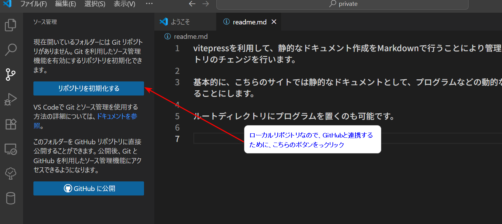
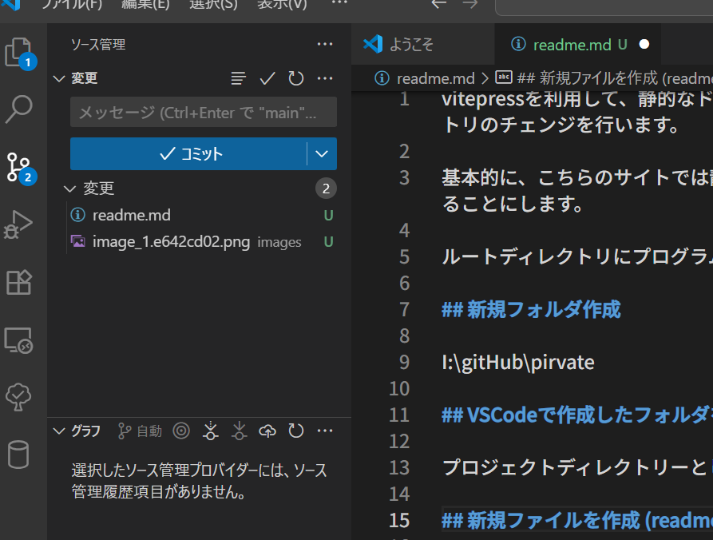
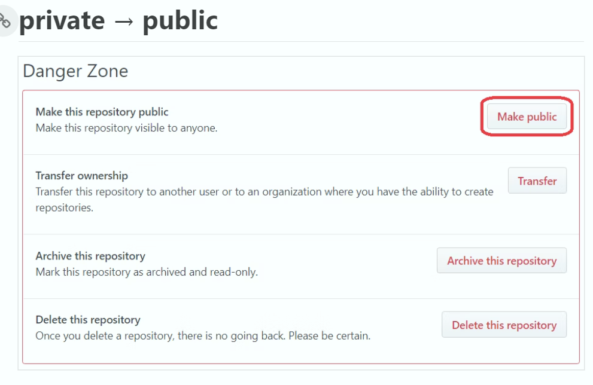
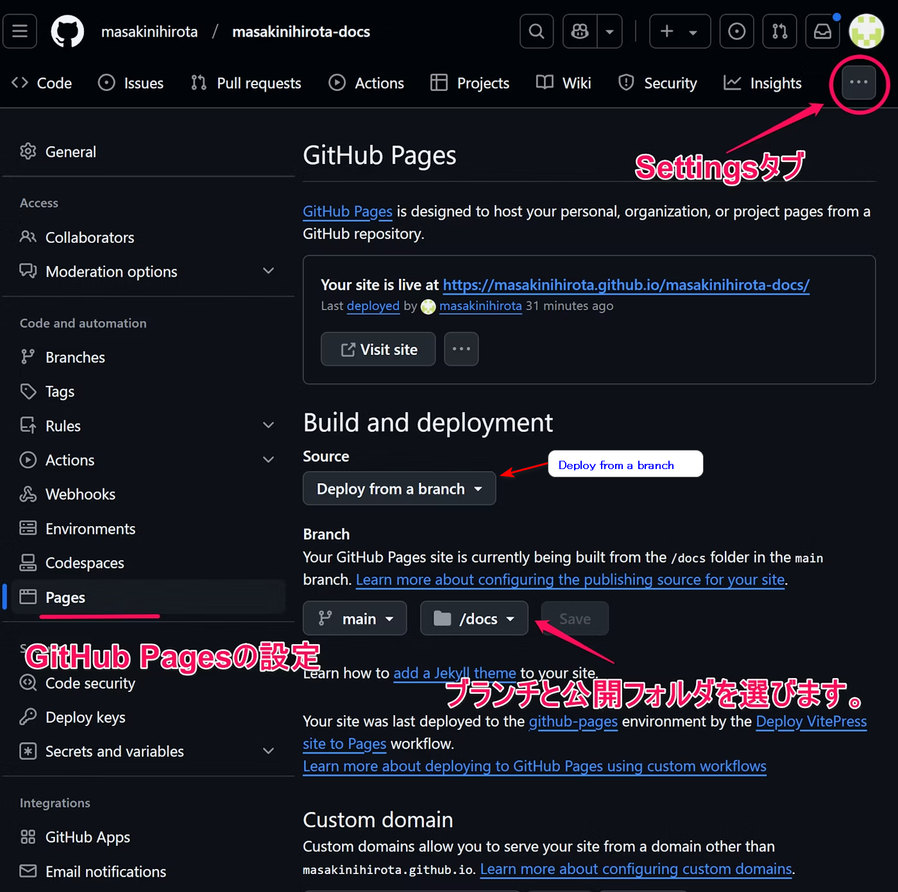

vitepressを利用して、静的なドキュメント作成をMarkdownで行うことにより管理を容易にするために大幅なディレクトリのチェンジを行います。

基本的に、こちらのサイトでは静的なドキュメントとして、プログラムなどの動的な物は、別のディレクトリで、管理することにします。

ルートディレクトリにプログラムを置くのも可能です。

# gitHubと連携
## 新規フォルダ作成
I:\gitHub\pirvate
## VSCodeで作成したフォルダを開く
プロジェクトディレクトリーとして開きます
## 新規ファイルを作成 (readme.md)
このファイル
## gitHub リポジトリの初期化
  
## ステージングにあげる

ファイルの説明を入力して、コミットすると「Branch発行」が表示されるので、それをクリックするとリモートにプッシュされて、フォルダ名の Repositoryが自動的に作成されます
gitHubとの連携が取れるようになります。

# vitepress で静的サイト作成

## vitepress インストール

```cmd
# ディレクトリ(I:\gitHub\private)に移動
npm add -D vitepress

added 168 packages in 33s

38 packages are looking for funding
  run `npm fund` for details
npm notice
npm notice New minor version of npm available! 11.4.1 -> 11.5.2
npm notice Changelog: https://github.com/npm/cli/releases/tag/v11.5.2
npm notice To update run: npm install -g npm@11.5.2
npm notice

```

## vitepress 初期化

Themeで、Default + Customizationを選択しているので、<span style="color:crimson;font-weight:bold;">vueが自動的にインストール</span>されます

```cmd
npx vitepress init


┌  Welcome to VitePress!
│
◇  Where should VitePress initialize the config?
│  ./docs
│
◇  Site title:
│  Documents & Papers
│
◇  Site description:
│  Store documents & Papers for Private
│
◇  Theme:
│  Default Theme + Customization
│
◇  Use TypeScript for config and theme files?
│  Yes
│
◇  Add VitePress npm scripts to package.json?
│  Yes
│
└  Done! Now run npm run docs:dev and start writing.

Tips:
- Make sure to add  docs/.vitepress/dist and  docs/.vitepress/cache to your .gitignore file.
- Since you've chosen to customize the theme, you should also explicitly install vue as a dev dependency.
```

## gitignore 
.gitignore ファイルに vitePress のキャッシュとビルド出力ディレクトリを追加

```txt
# node_modules
node_modules/

# VitePress cache
.vitepress/cache

# VitePress build output
.vitepress/dist
```

## gitHub

### gitHub public
リポジトリを公開にしないと build & deployできないので、公開設定にします。



### gitHub 設定



branchを指定するために、一度 deploy from a branch で、設定を行いますが、

### getHubリポジトリ actions

最後のはまったのは、https://takemoto61.github.io/private/
httpsで、アクセスしないと正常に表示されません。
